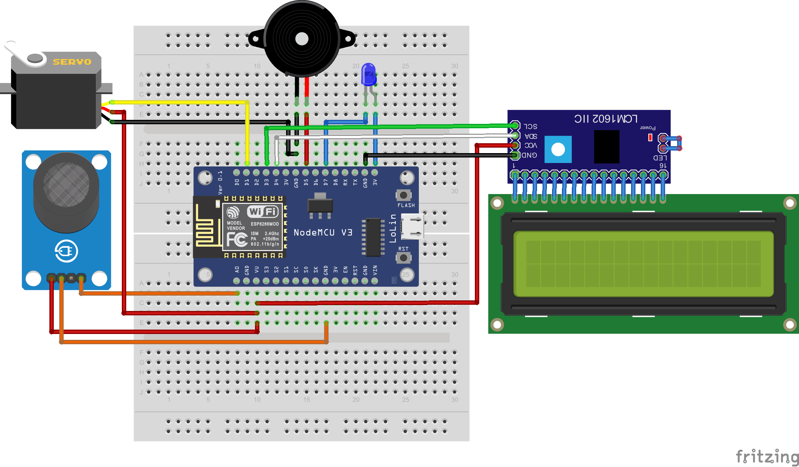
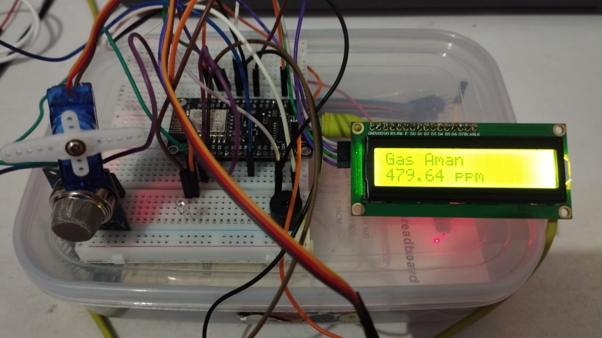
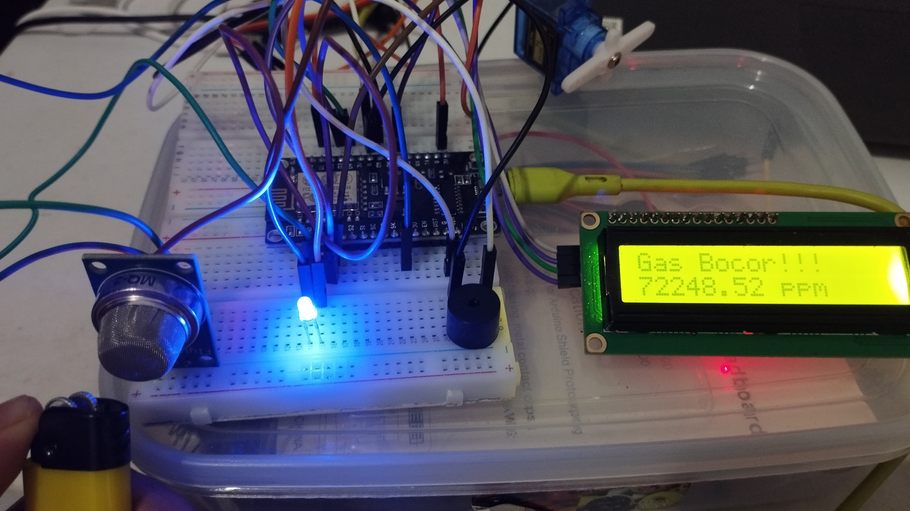
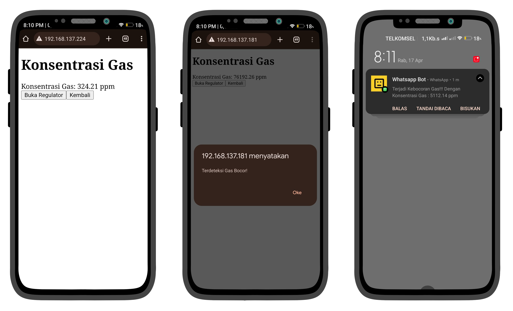

## Prototype of MQ-2 Sensor Integration on Whatsapp Bot and Web to Detect Gas Leaks

Liquefied Petroleum Gas (LPG) has become an important fuel in daily life, especially for cooking. However, the use of LPG gas carries the risk of leaks that can lead to dangerous fires and explosions. This study aims to develop a prototype gas leakage detection sensor based on the MQ-2 sensor to enhance the safety of LPG gas usage. The research method used is the prototype method, which involves four main stages: data collection, rapid planning, prototype design, and prototype testing. The results show that the prototype can effectively detect LPG gas leaks through the MQ-2 sensor and provide early warnings through an LCD display, buzzer sound, and notifications to the Web and WhatsApp. The conclusion of this research is that the MQ-2 sensor-based LPG gas leakage detection prototype can be an effective solution to prevent potential accidents due to gas leaks, increase awareness of safety in LPG gas usage, and reduce the risk of material losses and casualties.

### Prototype and Components of the System When Gas is Normalized

In the figure above, we can see the overall results of the prototype that has been built, in a condition where no gas leakage is detected. The sensor successfully identifies that the gas status is safe, which is reflected in the display. Thus, there is no buzzer activation, the LED light is off, and no notification is sent, either on the web or chat on WhatsApp. The display on the I2C LCD shows the "Gas Aman" status along with the gas concentration number that corresponds to the safety threshold.

### Prototype and Components of the Gas Leak System

In the picture above, we can see the results of the entire prototype that has been built, in the condition of a gas leak detection. The test was carried out by simulating a gas leak using gas from a lighter, which resulted in the activation of the buzzer, LED lights on, sending alert notifications on the web, chat notifications on WhatsApp, and the display on the I2C LCD shows the status of "Gas Bocor" along with a high gas concentration number.

### Prototype and Components of the Gas Leak System

In the image on the left, there is a display of a simple website that shows the normal conditions when the gas concentration is safe. The website displays the gas concentration number, as well as a button to control the gas regulator, both to open and close it.
On the other hand, the center image shows the website's reaction when the sensor detects a gas leak that causes the gas concentration to reach a high level. The website will display an alert that a gas leak has been detected, and also send a notification via WhatsApp to notify the user of the leak, so that the user can take the necessary precautions.
